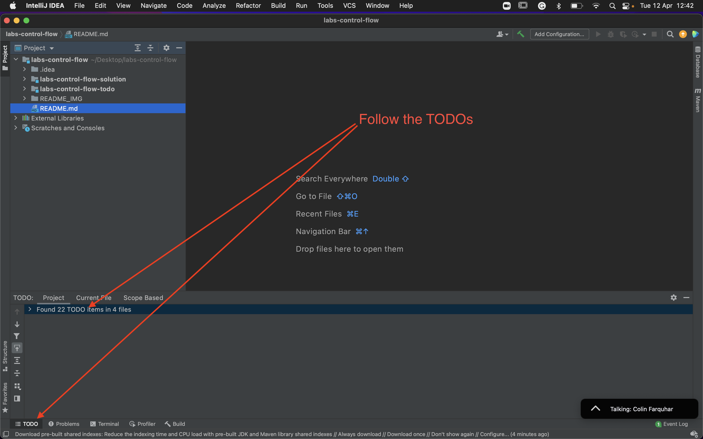
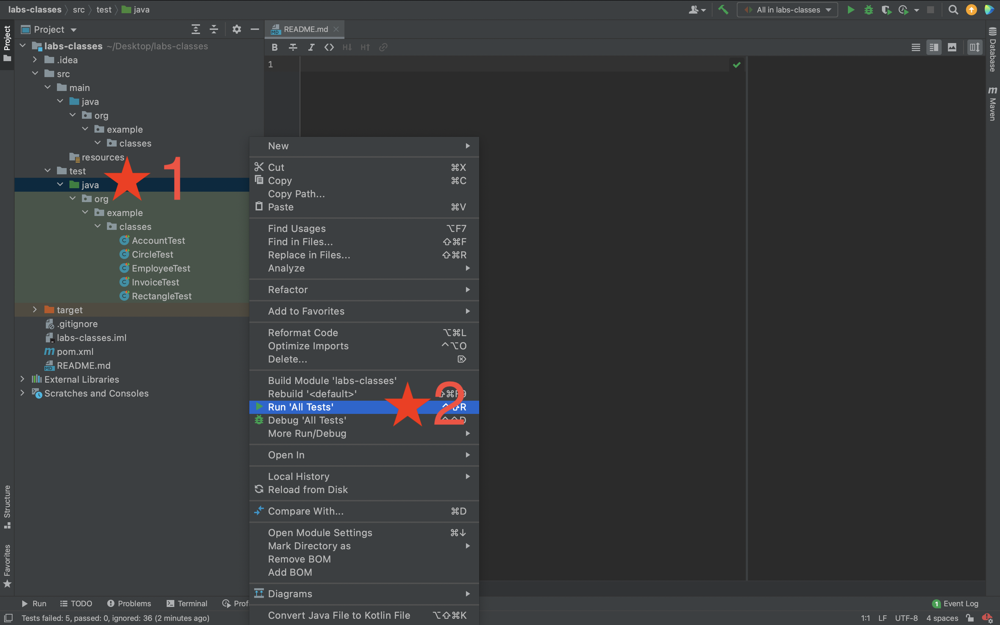
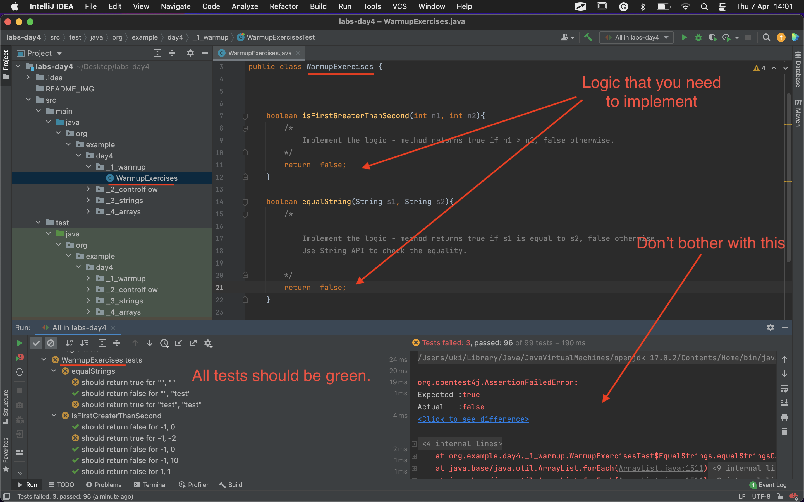
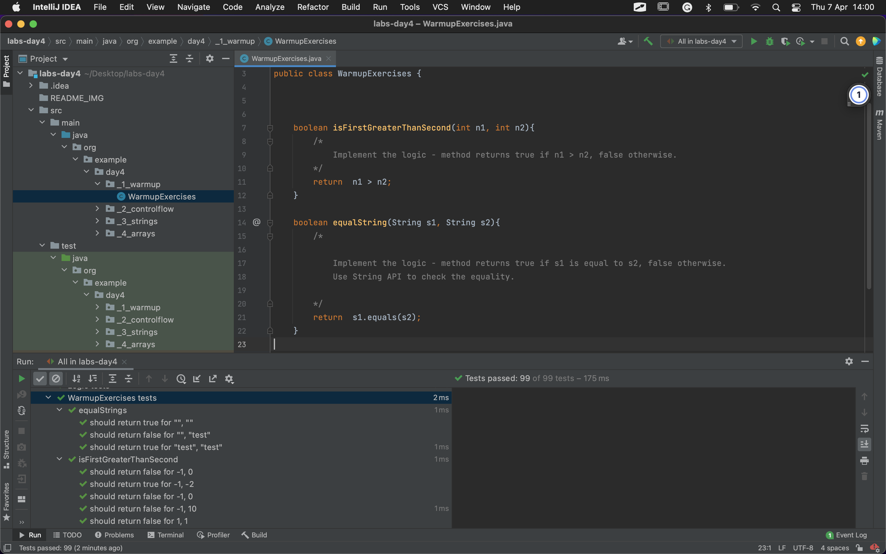

# Java exercises: control flow, String, Arrays

## Your task is to implement some logic in the provided methods - follow the TODOs

## Start by running the tests, implement the first method and rerun the tests. Repeat the process until all tests pass.

## How to run the tests

## The tests before your implementation

## The tests after the implementation

