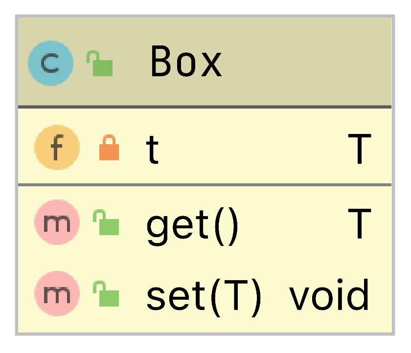
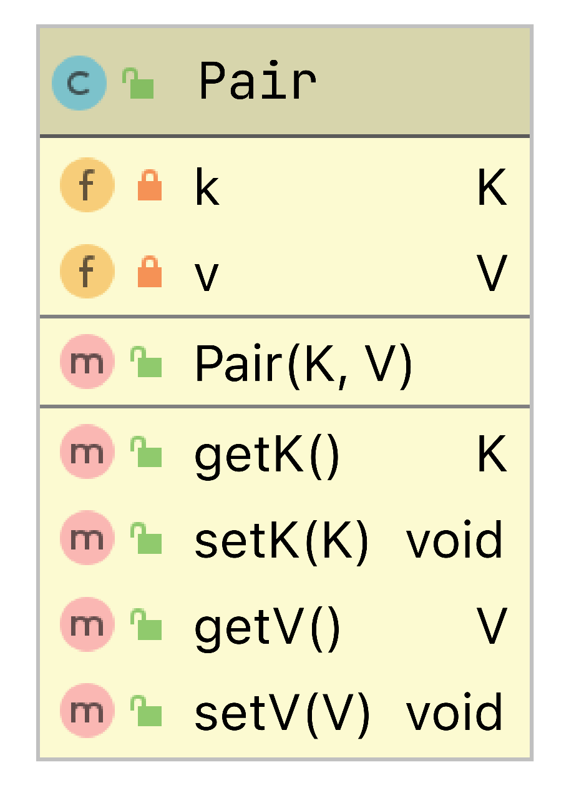
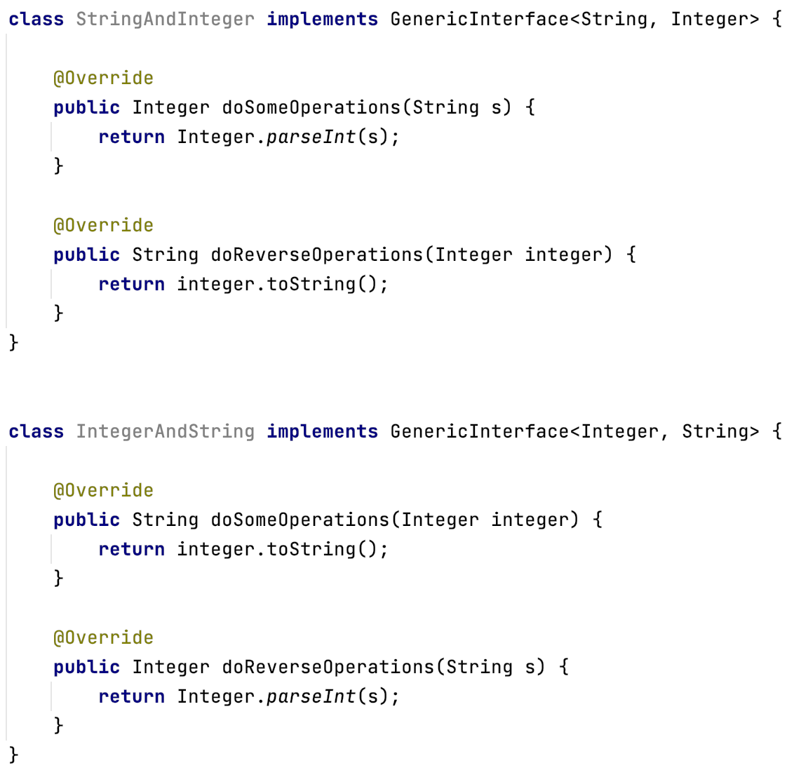
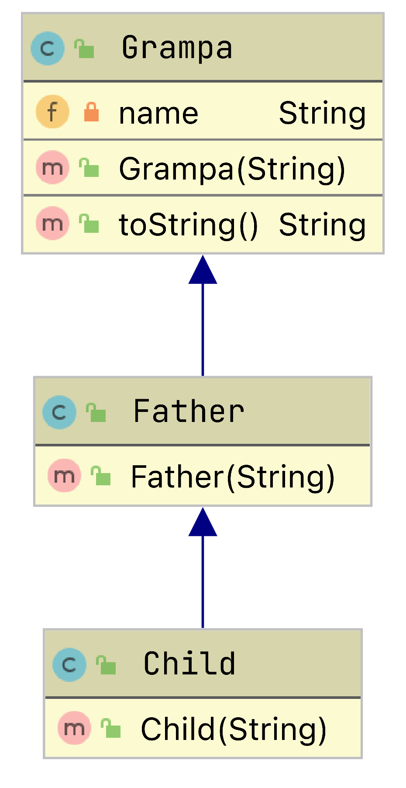
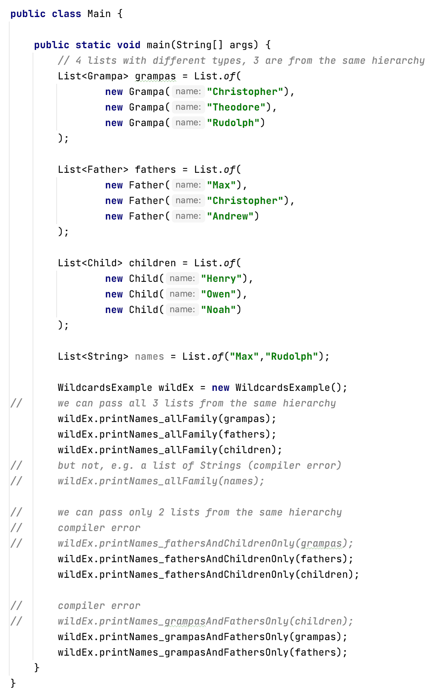

# Generics Exercises

## 1. Please create a new project
    Put each exercise in a separate package e.g. _1, _2. or simpleclass, class2params etc.

## 2. Create a simple, generic class, based on the below UML diagram

### Experiment with setters methods - what can be added to the first and second object?
        Box boxWithoutRestrictions = new Box();
        Box<Integer> boxForIntegersOnly = new Box();

## 3. Create a generic class with 2 params, based on the below UML diagram

###  Experiment with the class and it's methods

        Pair<String, Integer> pair1 = new Pair<>("", 10);
        Pair<Integer, String> pair2 = new Pair<>(20, ""); 
        Pair<String, String> pair3 = new Pair<>("", ""); 
        
        call the methods...

## 4. Create one generic interface for the below classes (implement the classes as well to check if the code compiles)

## 5. Wildcards 

### 5a Create a class hierarchy, based on the following UML diagram (toString() returns name property & class' name )

### 5b: Create a class WildcardExample with three, generic methods:
    printNames_fathersAndChildrenOnly - accepts only arguments of type: List<Father>, List<Children>
    printNames_grampasAndFathersOnly  - accepts only arguments of type: List<Father>, List<Grampa>
    printNames_all  - accepts only arguments of type: List<Father>, List<Grampa>, List<Children>

### Below is a code snipet showing how to test the class in the main method

