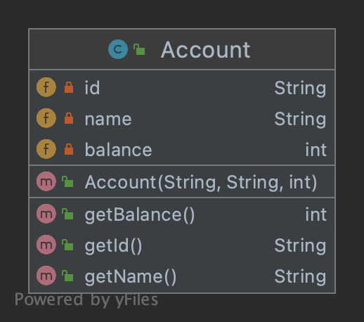
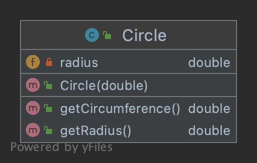
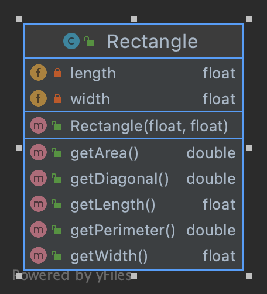
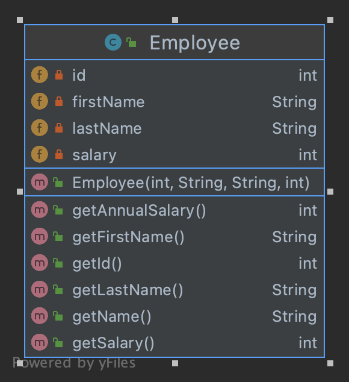
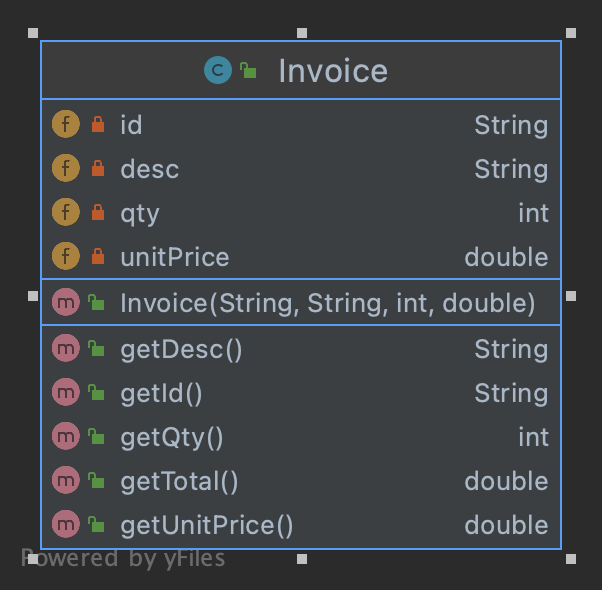
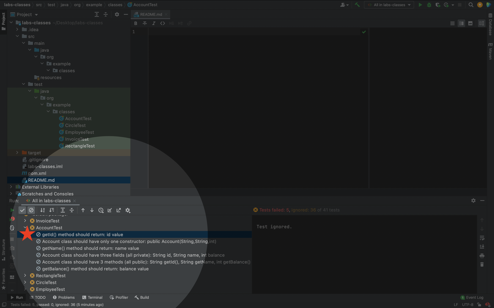
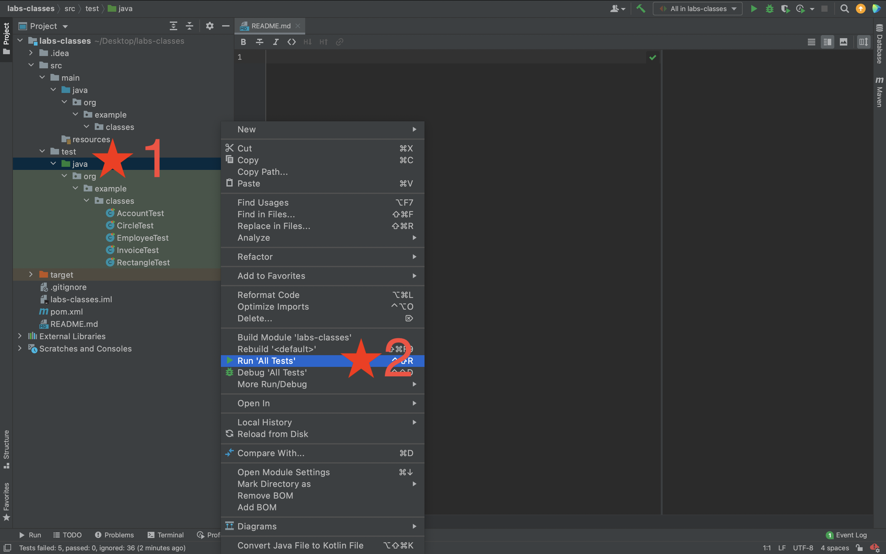

# Java Class exercises

## Create some classes based on the following UML diagrams:

### Account (It's already implemented for reference).

### Circle

### Rectangle

### Employee

### Invoice

## Implementations are specified in the test descriptions

## How to run the tests (to see the implementation details and to verify your work).

